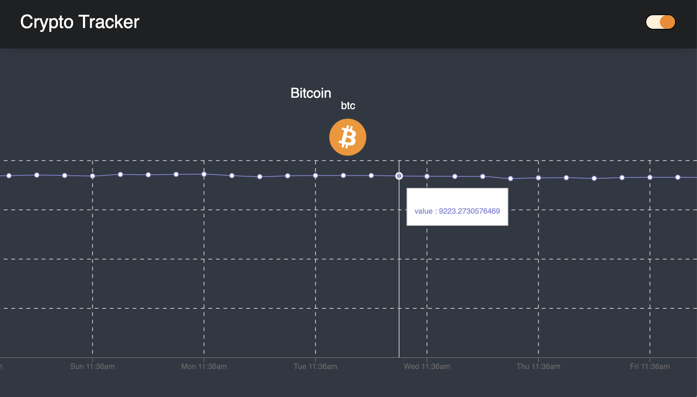

### Description

Crypto currency tracker app with two custom hooks that, when composed together, will allow users to set and persist a dark mode preference.

## Minimum Viable Product

- [ ] Build a custom hook that let's you save data to localStorage
- [ ] Build a second custom hook that sets the `dark-mode` class on the body element
- [ ] Compose your two new hooks together to be able to set and persist your user's dark mode preference in your app
